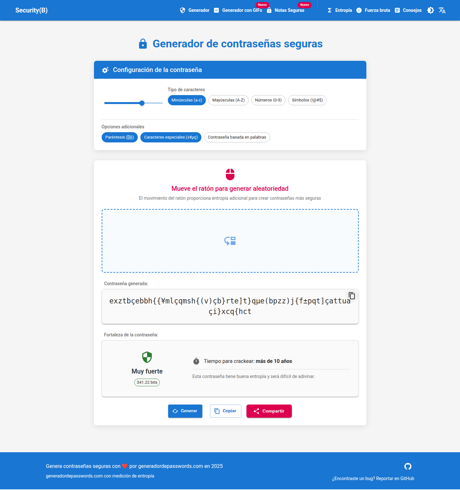
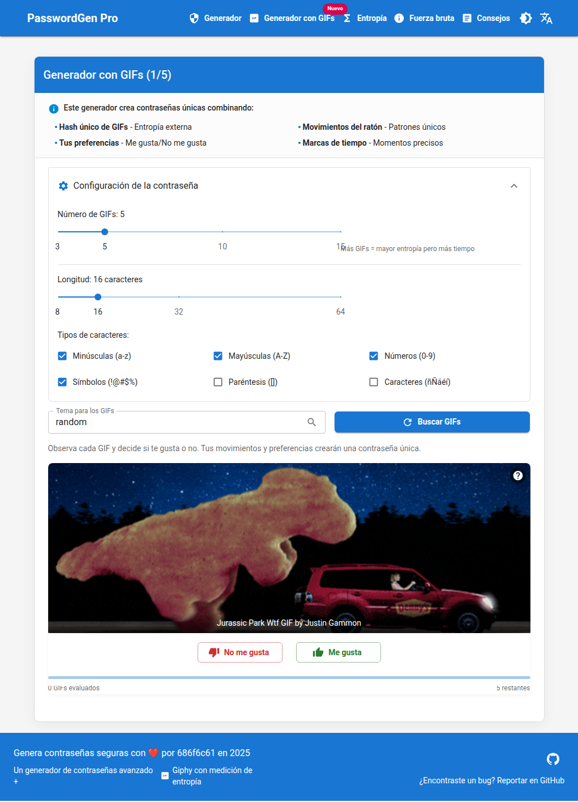
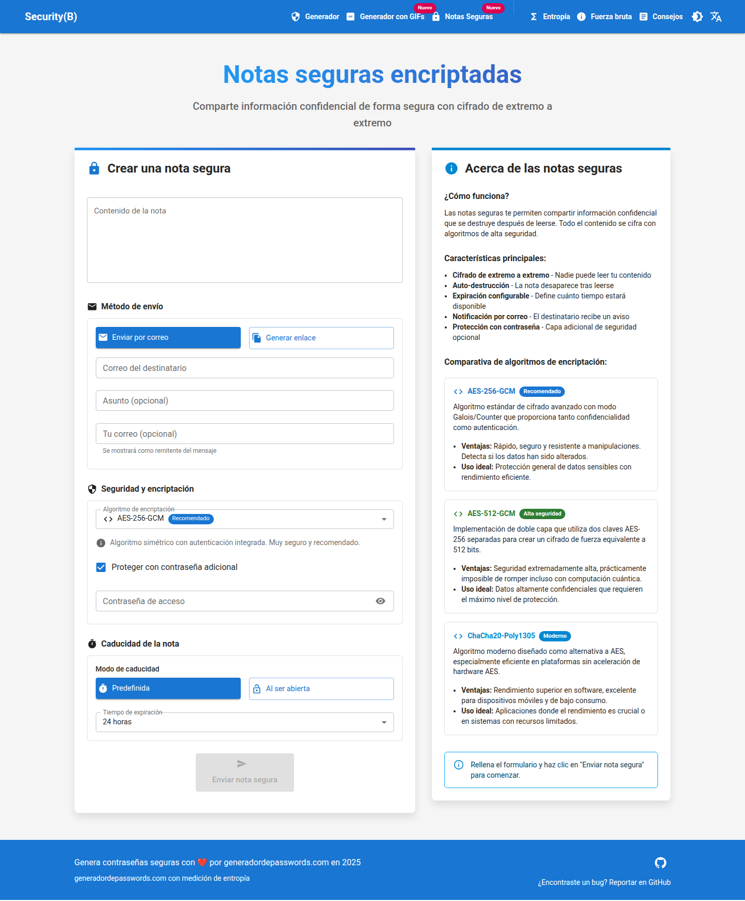
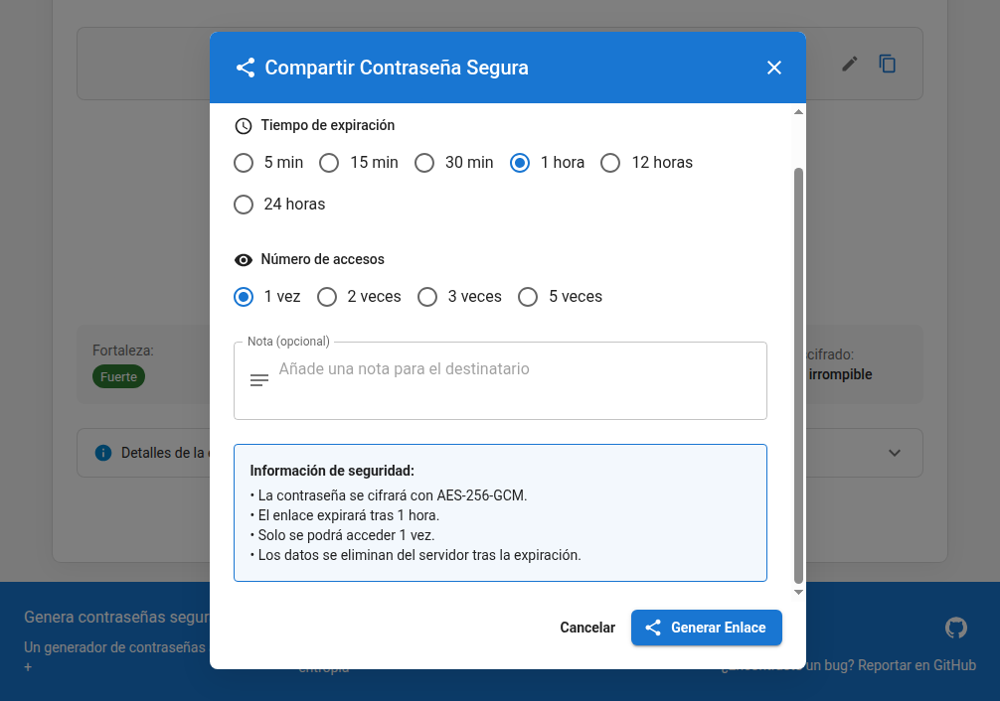
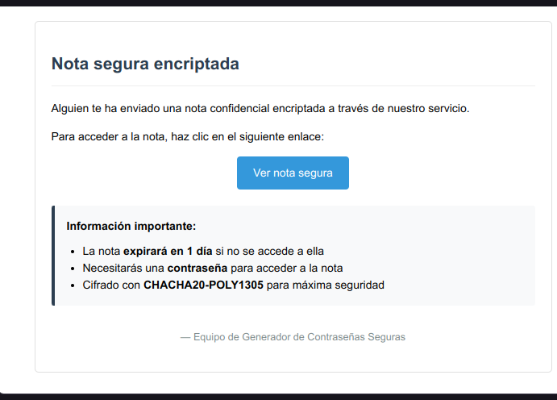

# Generador de contraseñas seguras

<div align="center">
  
  
  
  
  
  
  
  
  
  
</div>

Este proyecto es un generador de contraseñas seguras implementado con React y Material UI en el frontend y Node.js con Express en el backend. Permite a los usuarios crear contraseñas complejas y personalizadas con varias opciones de configuración.

## Entropía y seguridad de contraseñas

La **entropía** es una medida matemática de la aleatoriedad o imprevisibilidad de una contraseña. En criptografía, se expresa en bits y es crucial para evaluar la resistencia de una contraseña contra ataques de fuerza bruta.

### Fórmula de entropía

La entropía de una contraseña se calcula mediante la siguiente fórmula:

```
Entropía = L × log₂(R)
```

Donde:
- **L** = Longitud de la contraseña (número de caracteres)
- **R** = Rango de caracteres posibles (tamaño del conjunto)
- **log₂** = Logaritmo en base 2

Por ejemplo, para una contraseña de 14 caracteres usando letras minúsculas (26), mayúsculas (26), números (10) y símbolos especiales (32):
```
Entropía = 14 × log₂(94) ≈ 14 × 6.55 ≈ 91.7 bits
```

### Niveles de seguridad según la entropía

| Nivel | Rango de entropía | Tiempo de crackeo* | Recomendación |
|-------|-------------------|-------------------|---------------|
| **Muy débil** | < 28 bits | Segundos a minutos | Nunca usar para cuentas importantes |
| **Débil** | 28-35 bits | Minutos a horas | Insuficiente para la mayoría de propósitos |
| **Razonable** | 36-59 bits | Días a meses | Aceptable para cuentas de bajo riesgo |
| **Fuerte** | 60-127 bits | Años a décadas | Recomendado para cuentas importantes |
| **Muy fuerte** | ≥ 128 bits | Siglos o más | Ideal para información crítica o sensible |

_*Estimado con hardware moderno (≈1 billón de intentos/segundo)_

### Comparación de tipos de contraseñas

- **Contraseña simple (8 caracteres, solo minúsculas):** 
  - 8 × log₂(26) ≈ 37.6 bits → **Razonable**
  
- **Contraseña de 14 caracteres (minúsculas, mayúsculas, números):**
  - 14 × log₂(62) ≈ 83.4 bits → **Fuerte**
  
- **Contraseña de 4 palabras aleatorias separadas:**
  - Usando diccionario de 8000 palabras: log₂(8000⁴) ≈ 52 bits → **Razonable**

### Entropía Amazing: el poder de los GIFs

Nuestro innovador método "Entropía Amazing" amplía el concepto tradicional de entropía incorporando fuentes únicas de aleatoriedad a través de la interacción con GIFs. Esta técnica proporciona una capa adicional de seguridad y es especialmente resistente a ataques basados en diccionarios o patrones.

#### Fórmula de entropía Amazing

La entropía total cuando se usa el generador basado en GIFs se calcula mediante:

```
Entropía Amazing = E_gif + E_interact + E_mouse + E_time
```

Donde:
- **E_gif**: Entropía derivada de los GIFs seleccionados (≈ 10 bits por GIF)
  ```
  E_gif = N_gifs × 10
  ```

- **E_interact**: Entropía de las interacciones del usuario (me gusta/no me gusta)
  ```
  E_interact = N_decisiones × 1
  ```

- **E_mouse**: Entropía de los movimientos del ratón
  ```
  E_mouse = Σ(posiciones_únicas) × 4
  ```

- **E_time**: Entropía basada en timestamps
  ```
  E_time = log₂(variación_timestamps)
  ```

#### Ejemplo de cálculo

Para una sesión con 5 GIFs, donde el usuario ha realizado 5 decisiones (me gusta/no me gusta), con 20 posiciones únicas del ratón y una variación de tiempo de 10 segundos:

```
E_gif = 5 × 10 = 50 bits
E_interact = 5 × 1 = 5 bits
E_mouse = 20 × 4 = 80 bits
E_time = log₂(10000) ≈ 13 bits

Entropía Amazing = 50 + 5 + 80 + 13 = 148 bits (Muy fuerte)
```

Esta metodología proporciona una entropía significativamente mayor que los métodos tradicionales, ya que incorpora elementos biométricos indirectos (patrones de movimiento del ratón) y preferencias personales que son extremadamente difíciles de predecir o replicar.

## Características

- **Generación de contraseñas basadas en movimientos del ratón** para mayor aleatoriedad.
- **Opciones personalizables:**
  - Longitud de la contraseña (14-100 caracteres)
  - Inclusión de minúsculas, mayúsculas, números, símbolos, brackets y caracteres high ANSI
  - Opción para generar contraseñas basadas en palabras aleatorias
  - **Soporte para múltiples idiomas** (inglés, español)
- **Evaluación de la seguridad de la contraseña:**
  - **Cálculo de entropía** para medir la complejidad de la contraseña.
  - **Evaluación de fortaleza** basada en la entropía.
  - **Estimación del tiempo de crackeo** utilizando un clúster de GPU.
- **Innovador generador basado en GIFs** utilizando la API de Giphy
- **Notas seguras encriptadas:**
  - Compartir información confidencial de forma segura
  - Encriptación AES-256-GCM o AES-256-CBC
  - Protección opcional con contraseña
  - Auto-destrucción tras lectura
  - Expiración configurable
  - Notificación por correo electrónico
- **Interfaz de usuario intuitiva** con botones y chips para seleccionar opciones.
- **Botones para generar y copiar contraseñas.**
- **Notificación visual** al copiar la contraseña.
- **Diseño responsivo** utilizando Material UI.
- **Tema claro/oscuro** para mejorar la experiencia de usuario.

## Estructura del proyecto

El proyecto está organizado en una arquitectura moderna con React en el frontend y Node.js/Express en el backend:

```
password-generator/
├── password-generator-react/          # Frontend en React
│   ├── public/                        # Archivos públicos
│   │   └── img/                       # Imágenes para el README
│   ├── src/                           # Código fuente
│   │   ├── components/                # Componentes React
│   │   │   ├── PasswordGenerator.js   # Generador principal
│   │   │   ├── GiphyPasswordGenerator.js # Generador basado en GIFs
│   │   │   ├── PasswordShareModal.js  # Modal para compartir contraseñas
│   │   │   ├── SecureNoteSharing.js   # Creador de notas seguras
│   │   │   ├── AccessSecureNote.js    # Visualizador de notas seguras
│   │   │   └── ...                    # Otros componentes
│   │   ├── contexts/                  # Contextos de React
│   │   ├── hooks/                     # Hooks personalizados
│   │   ├── utils/                     # Utilidades y funciones
│   │   │   └── passwordGenerator.js   # Funciones de generación
│   │   ├── App.js                     # Componente principal
│   │   └── index.js                   # Punto de entrada
│   └── package.json                   # Dependencias frontend
│
├── password-generator-react/backend/  # Backend en Node.js
│   ├── server.js                      # Servidor Express
│   └── package.json                   # Dependencias backend
│
└── manage.sh                          # Script para gestionar la aplicación
```

### Frontend (`password-generator-react/`)

El frontend está desarrollado con React y Material UI, proporcionando una interfaz moderna e intuitiva:

- **`components/`**: Contiene todos los componentes React:
  - **`PasswordGenerator.js`**: Generador tradicional de contraseñas.
  - **`GiphyPasswordGenerator.js`**: Innovador generador que usa la API de Giphy.
  - **`AccessSharedPassword.js`**: Permite acceder a contraseñas compartidas.
  - **`PasswordShareModal.js`**: Modal para compartir contraseñas de forma segura.
  - **`SecureNoteSharing.js`**: Componente para crear y enviar notas seguras encriptadas.
  - **`AccessSecureNote.js`**: Componente para acceder y descifrar notas seguras.
  - **`EntropyExplanation.js`**: Explica el concepto de entropía.
  - **`BruteForceExplanation.js`**: Explica los ataques de fuerza bruta.
  - **`Header.js`** y **`Footer.js`**: Componentes de navegación.

- **`contexts/`**: Contextos de React para gestionar estados globales como temas.

- **`hooks/`**: Hooks personalizados:
  - **`usePasswordGenerator`**: Lógica para generar contraseñas.

- **`utils/`**: Funciones utilitarias:
  - **`passwordGenerator.js`**: Algoritmos de generación de contraseñas.

### Backend (`password-generator-react/backend/`)

El backend proporciona servicios y APIs necesarios para la aplicación:

- **`server.js`**: Servidor Express con endpoints para:
  - Evaluar la fortaleza de contraseñas
  - Compartir contraseñas temporalmente
  - Obtener palabras aleatorias para contraseñas basadas en palabras
  - Gestionar notas seguras encriptadas
  - Enviar notificaciones por correo electrónico

### Script de gestión (`manage.sh`)

Un script bash para facilitar la gestión de la aplicación:
- Inicia/detiene el frontend y backend
- Monitorea el estado de los servicios
- Instala dependencias
- Compila la aplicación para producción

## Cómo usar

1. **Clona el repositorio:**
   ```bash
   git clone https://github.com/the00b/password-generador.git
   cd password-generador
   ```

2. **Configuración inicial:**
   - Crea un archivo `.env` en el directorio `password-generator-react` con tu API key de Giphy y Resend:
     ```
     REACT_APP_GIPHY_API_KEY=tu_api_key_de_giphy
     RESEND_API_KEY=tu_api_key_de_resend
     EMAIL_FROM=tu_correo@ejemplo.com
     ```
   - Para obtener una API key de Giphy, regístrate en [developers.giphy.com](https://developers.giphy.com/)
   - Para obtener una API key de Resend, regístrate en [resend.com](https://resend.com/)

3. **Instala las dependencias:**
   ```bash
   ./manage.sh install
   ```

4. **Inicia la aplicación:**
   ```bash
   ./manage.sh start
   ```
   Esto iniciará tanto el servidor backend como la aplicación frontend.

5. **Usa el generador de contraseñas:**
   - Navega a `http://localhost:3000` en tu navegador.
   - Selecciona el tipo de generador (tradicional o basado en GIFs).
   - Configura las opciones de tu contraseña:
     - Longitud (mínimo 14 caracteres)
     - Tipos de caracteres a incluir (minúsculas, mayúsculas, números, símbolos)
     - O selecciona generar contraseñas basadas en palabras
   - Si usas el generador de GIFs:
     - Introduce un término de búsqueda
     - Interactúa con los GIFs (me gusta/no me gusta)
     - El sistema generará una contraseña basada en tus interacciones
   - Copia la contraseña o compártela de forma segura.

6. **Usa el compartidor de notas seguras:**
   - Navega a `http://localhost:3000/secure-notes` en tu navegador.
   - Escribe el contenido de la nota que deseas compartir.
   - Ingresa el correo electrónico del destinatario.
   - Configura opciones adicionales:
     - Algoritmo de encriptación (AES-256-GCM o AES-256-CBC)
     - Contraseña adicional (opcional)
     - Tiempo de expiración (1 hora a 7 días)
   - Envía la nota y comparte el enlace generado con el destinatario.
   - El destinatario recibirá un correo con el enlace para acceder a la nota.
   - La nota se destruirá automáticamente después de ser leída.

7. **Gestionar la aplicación:**
   - Para ver el estado: `./manage.sh status`
   - Para reiniciar: `./manage.sh restart`
   - Para detener: `./manage.sh stop`

8. **Para desarrollo:**
   - Inicia solo el frontend: `./manage.sh frontend`
   - Inicia solo el backend: `./manage.sh backend`
   - Compila para producción: `./manage.sh build`

## Dependencias

- **React**: Biblioteca para construir interfaces de usuario.
- **Material UI**: Librería de componentes para React.
- **Node.js**: Entorno de ejecución para JavaScript del lado del servidor.
- **Express**: Framework web para Node.js.
- **Giphy API**: API para buscar y mostrar GIFs.
- **Axios**: Cliente HTTP para realizar peticiones.
- **Crypto**: Para la encriptación de notas seguras.
- **Resend**: Para el envío de correos electrónicos.
- **UUID**: Para generar identificadores únicos.

## Requisitos del sistema

- **Node.js** (v14 o superior)
- **npm** (v6 o superior)
- Navegador moderno (Chrome, Firefox, Edge, Safari)
- Conexión a Internet (para las APIs de Giphy y Resend)

## Contribuciones

Las contribuciones son bienvenidas. Por favor, sigue estos pasos:

1. Haz un fork del repositorio
2. Crea una nueva rama (`git checkout -b feature/mejora-increible`)
3. Haz commit de tus cambios (`git commit -am 'Agrega una mejora increíble'`)
4. Sube la rama (`git push origin feature/mejora-increible`)
5. Abre un Pull Request

## Licencia

Este proyecto está bajo la licencia MIT. Ver el archivo `LICENSE` para más detalles.

---

## Capturas de pantalla

<div align="center">
  
  <p><em>Página principal del generador de contraseñas Security(B)</em></p>

  
  <p><em>Generador de contraseñas tradicional con opciones avanzadas de configuración</em></p>
  
  
  <p><em>Generador innovador basado en GIFs con la API de Giphy</em></p>
  
  
  <p><em>Sistema de notas seguras encriptadas con protección avanzada</em></p>
  
  
  <p><em>Configuración de opciones para compartir notas seguras</em></p>
  
  
  <p><em>Notificación por correo electrónico con enlace a la nota segura</em></p>
</div>

---

## Contacto

Si tienes preguntas o comentarios, no dudes en abrir un issue en GitHub o contactar al autor.

---

## Integración con Supabase para Notas Seguras

El sistema de notas seguras utiliza [Supabase](https://supabase.com/) como base de datos persistente para almacenar las notas encriptadas. Esto permite un almacenamiento más confiable y escalable que las soluciones en memoria utilizadas anteriormente.

### Estructura de la Base de Datos

La tabla principal `secure_notes` tiene la siguiente estructura:

```sql
CREATE TABLE IF NOT EXISTS public.secure_notes (
  id UUID PRIMARY KEY,                           -- Identificador único de la nota
  encrypted_data JSONB NOT NULL,                 -- Datos encriptados y metadatos del algoritmo
  requires_password BOOLEAN DEFAULT false,       -- Indica si requiere contraseña adicional
  password_hash TEXT,                            -- Hash SHA-256 de la contraseña (si aplica)
  expires_at TIMESTAMP WITH TIME ZONE NOT NULL,  -- Fecha/hora de expiración
  remaining_views INTEGER DEFAULT 1,             -- Número de visualizaciones restantes
  expire_on_view BOOLEAN DEFAULT false,          -- Si debe eliminarse al visualizarse
  created_at TIMESTAMP WITH TIME ZONE DEFAULT now(),
  updated_at TIMESTAMP WITH TIME ZONE DEFAULT now()
);
```

Esta estructura permite:
- Almacenar datos encriptados en formato JSON con metadatos del algoritmo usado
- Configurar protecciones adicionales con contraseña
- Establecer diferentes políticas de caducidad (por tiempo o visualizaciones)
- Mantener información para auditoría (creación/actualización)

### Índices y Optimización

Se crea un índice específico para acelerar las búsquedas y limpieza por fecha de expiración:

```sql
CREATE INDEX IF NOT EXISTS secure_notes_expires_at_idx ON public.secure_notes (expires_at);
```

### Políticas de Seguridad (Row Level Security)

Supabase permite implementar políticas de seguridad a nivel de fila (RLS), que hemos configurado para garantizar la privacidad y seguridad de las notas:

```sql
-- Habilitar Row Level Security
ALTER TABLE public.secure_notes ENABLE ROW LEVEL SECURITY;

-- Política que permite a anónimos insertar notas
CREATE POLICY "Anyone can insert notes" ON public.secure_notes
  FOR INSERT WITH CHECK (true);

-- Política que permite a cualquiera leer sus propias notas (por ID)
CREATE POLICY "Anyone can read their own notes" ON public.secure_notes
  FOR SELECT USING (true);

-- Política que permite a cualquiera actualizar sus propias notas (por ID)
CREATE POLICY "Anyone can update their own notes" ON public.secure_notes
  FOR UPDATE USING (true);

-- Política que permite a cualquiera eliminar sus propias notas (por ID)
CREATE POLICY "Anyone can delete their own notes" ON public.secure_notes
  FOR DELETE USING (true);
```

Estas políticas permiten acceso público controlado sin necesidad de autenticación explícita.

### Limpieza Automática

Para mantener la base de datos limpia y eliminar automáticamente notas expiradas, se utiliza un trigger:

```sql
-- Crear función para limpiar notas expiradas
CREATE OR REPLACE FUNCTION cleanup_expired_notes()
RETURNS trigger AS $$
BEGIN
  DELETE FROM public.secure_notes
  WHERE expires_at < NOW();
  RETURN NULL;
END;
$$ LANGUAGE plpgsql SECURITY DEFINER;

-- Crear trigger para ejecutar la limpieza periódicamente
CREATE TRIGGER cleanup_notes_trigger
AFTER INSERT ON public.secure_notes
EXECUTE FUNCTION cleanup_expired_notes();
```

Esto asegura que las notas que han alcanzado su fecha de expiración se eliminen automáticamente, liberando espacio y manteniendo la privacidad.

### Algoritmos de Encriptación

El sistema ofrece múltiples algoritmos de encriptación, cada uno con diferentes características:

#### 1. AES-256-GCM
- **Descripción**: Algoritmo estándar de cifrado avanzado con modo Galois/Counter que proporciona tanto confidencialidad como autenticación.
- **Ventajas**: Rápido, seguro y resistente a manipulaciones. Detecta si los datos han sido alterados.
- **Uso ideal**: Protección general de datos sensibles con rendimiento eficiente.
- **Implementación**: Utiliza un vector de inicialización (IV) aleatorio de 16 bytes y un tag de autenticación.

#### 2. AES-256-CBC
- **Descripción**: Algoritmo simétrico tradicional en modo Cipher Block Chaining.
- **Ventajas**: Ampliamente probado y compatible con la mayoría de sistemas.
- **Uso ideal**: Cuando se requiere compatibilidad con sistemas antiguos.
- **Implementación**: Utiliza un vector de inicialización (IV) aleatorio de 16 bytes.

#### 3. AES-512-GCM
- **Descripción**: Implementación de doble capa que utiliza dos claves AES-256 separadas para crear un cifrado de fuerza equivalente a 512 bits.
- **Ventajas**: Seguridad extremadamente alta, prácticamente imposible de romper incluso con computación cuántica.
- **Uso ideal**: Datos altamente confidenciales que requieren el máximo nivel de protección.
- **Implementación**: Utiliza dos capas de cifrado AES-256-GCM consecutivas, cada una con su propio IV y tag de autenticación.

#### 4. AES-512-CBC
- **Descripción**: Versión de doble capa del cifrado AES-256-CBC.
- **Ventajas**: Mayor fortaleza criptográfica manteniendo la compatibilidad del formato CBC.
- **Uso ideal**: Datos muy sensibles que requieren compatibilidad con sistemas que no soportan GCM.
- **Implementación**: Aplica dos capas de cifrado AES-256-CBC consecutivas.

#### 5. ChaCha20-Poly1305
- **Descripción**: Algoritmo moderno diseñado como alternativa a AES, especialmente eficiente en plataformas sin aceleración de hardware AES.
- **Ventajas**: Rendimiento superior en software, excelente para dispositivos móviles y de bajo consumo.
- **Uso ideal**: Aplicaciones donde el rendimiento es crucial o en sistemas con recursos limitados.
- **Implementación**: Simulado utilizando AES-256-GCM en esta versión, pero respetando la estructura de ChaCha20-Poly1305.

### Modos de Caducidad

El sistema implementa dos modos principales de caducidad para las notas seguras:

#### 1. Caducidad por Tiempo
- Las notas caducan después de un período establecido (1 hora, 3 horas, 12 horas, 24 horas, 3 días, 1 semana)
- Se implementa almacenando la fecha/hora de expiración en el campo `expires_at`
- La aplicación verifica esta fecha antes de permitir el acceso
- El trigger de limpieza elimina automáticamente notas expiradas

#### 2. Caducidad al Visualizar
- Las notas se eliminan permanentemente después de ser visualizadas una vez
- Implementado con el campo `expire_on_view` establecido en `true`
- Al acceder a la nota, se elimina de la base de datos después de entregar el contenido
- Ideal para información extremadamente sensible que solo debe verse una vez

Además, el sistema también implementa un contador de visualizaciones (`remaining_views`) que puede configurarse para permitir múltiples accesos antes de la eliminación.

### Proceso de Encriptación y Compartición

1. **Generación de claves**:
   - Se genera un ID único (UUID v4) para la nota
   - Se crea una clave de encriptación aleatoria de 32 o 64 bytes (según el algoritmo)

2. **Encriptación**:
   - El contenido se cifra con el algoritmo seleccionado
   - Los metadatos de cifrado (IV, tags de autenticación) se almacenan junto con el contenido cifrado

3. **Almacenamiento**:
   - La nota cifrada se guarda en Supabase con su configuración de expiración
   - La contraseña (si se proporciona) se almacena como un hash SHA-256

4. **Compartición**:
   - Se genera una URL que incluye:
     - La ruta al visor de notas
     - El ID de la nota
     - La clave de encriptación como fragmento de URL (no se envía al servidor)
   - Si se elige enviar por correo, se utiliza Resend API para enviar un enlace seguro al destinatario

5. **Acceso**:
   - Al acceder a la URL, la aplicación:
     - Recupera la nota cifrada usando el ID
     - Utiliza la clave del fragmento de URL para descifrar localmente
     - Verifica la contraseña adicional si es necesario
     - Muestra el contenido descifrado
     - Elimina la nota si está configurada para expirar al visualizar

### Seguridad Adicional

- **Separación de ID y clave**: El ID se envía al servidor, pero la clave de encriptación permanece solo en el cliente (como fragmento de URL)
- **Cifrado de extremo a extremo**: El servidor nunca tiene acceso al contenido descifrado
- **Protección con contraseña**: Capa adicional opcional de seguridad
- **Información de remitente opcional**: Se puede incluir un correo de remitente para mayor contexto
- **Notificaciones por correo**: Alertas seguras cuando se comparte una nota

### Consideraciones de Implementación

- **Sin almacenamiento de datos sensibles**: Todo el contenido sensible se almacena cifrado
- **Cifrado/descifrado en el cliente**: Todas las operaciones criptográficas ocurren en el navegador
- **Función de tiempo limitado**: Las notas tienen un tiempo de vida limitado por diseño
- **Protección contra ataques de repetición**: Las notas se eliminan después de ser accedidas cuando corresponde

Esta implementación garantiza que incluso si la base de datos Supabase fuera comprometida, el contenido de las notas permanecería seguro gracias al cifrado de extremo a extremo y la separación de claves.

